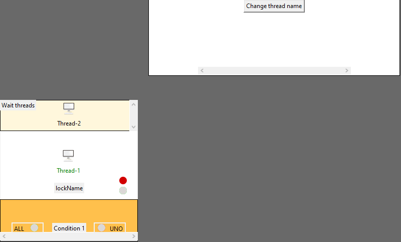

Library originally made by Guido Scarlato, forked by Davide Caligiuri.

# GraphThreading



### Example
``` python 
# to obtain a perfectly valid multithreading code, replace with:
# from threading import Lock, Thread, Condition
from threadmonitor.wrapper.threading import Lock, Thread, Condition
from threadmonitor.view.controllers import startGraph

class Structure:
    def __init__(self):
        self.lock = Lock()
        self.condition = Condition(self.lock)
    
    def get(self):
        self.lock.acquire()
        self.lock.release()

class MyThread(GraphThread):
    def __init__(self,structure):
        super().__init__()
        self.structure = structure

    def run(self):
        while True:
            self.structure.get()
            
structure = Structure()
threads = []

for i in range(4):
    t = MyThread(structure)
    threads.append(t)

for t in threads:
    t.start()

startGraph()
```

---
### Clone

- Clone this repo to your local machine using `https://github.com/Dygwah98/threadmonitor`
---
### Setup

> using pipenv:

```shell
pipenv install 
```

> manual installation:

```shell
sudo apt-get install python3-tk
pip3 install Pillow 
```

---

## Features
> Graphic representation of the components

> Start and stop the whole system

> Excecution step by step 

> Seamless integration with the existing threading module