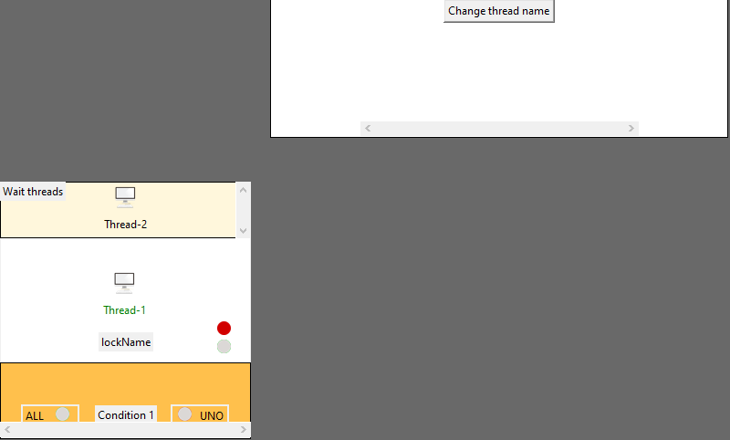

Library made by Guido Scarlato.

# GraphThreading



### Example
``` python 
from graphthreading import Controller,GraphLock,GraphThread,GraphCondition
from threading import Thread,current_thread
from time import sleep
import graphthreading


class Structure:
    def __init__(self):
        self.lock = GraphLock()
        self.condition = GraphCondition(self.lock)
        self.lock.setName('lockName')
    
    def get(self):
        self.lock.acquire()
        self.lock.release()

class MyThread(GraphThread):
    def __init__(self,structure,sctructure2,structure3):
        super().__init__()
        self.structures=structure

    def run(self):
        while True:
            self.structures.get()
            
structure = Structure()
threads = []

for i in range(4):
    t = MyThread(structure,structure2,structure3)
    threads.append(t)

for t in threads:
    t.start()

graphthreading.startGraph()
```

---
### Clone

- Clone this repo to your local machine using `https://github.com/guidoscarl/threadmonitor.git`
---
### Setup

> install python packages

```shell
sudo apt-get install python3-tk
pip3 install Pillow 
```


---

## Features
> Graphic representation of the components

> Start and stop the whole system

> Exceution step by step 


